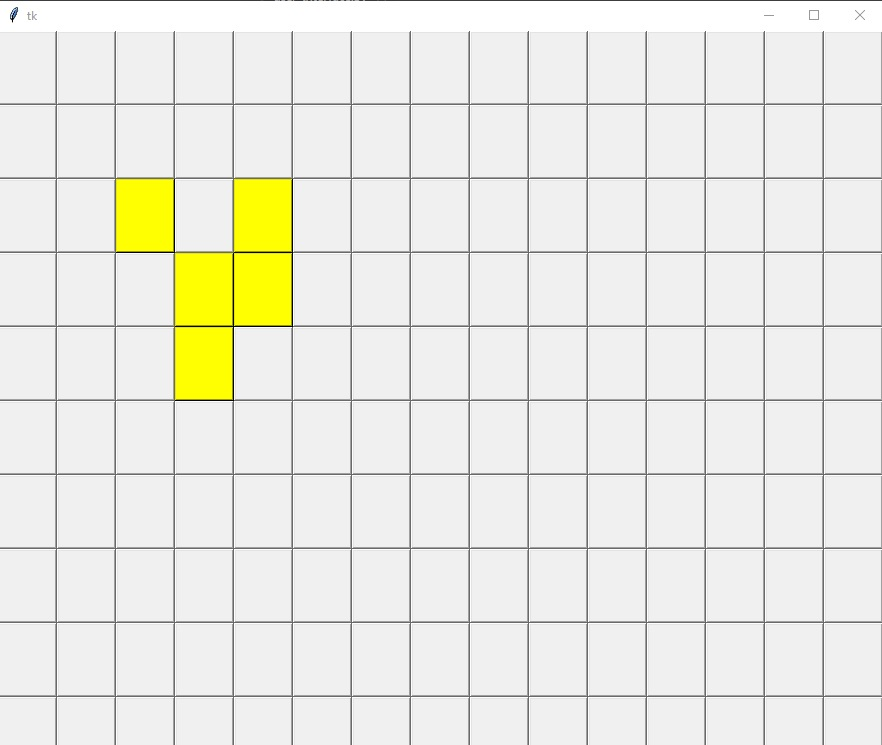
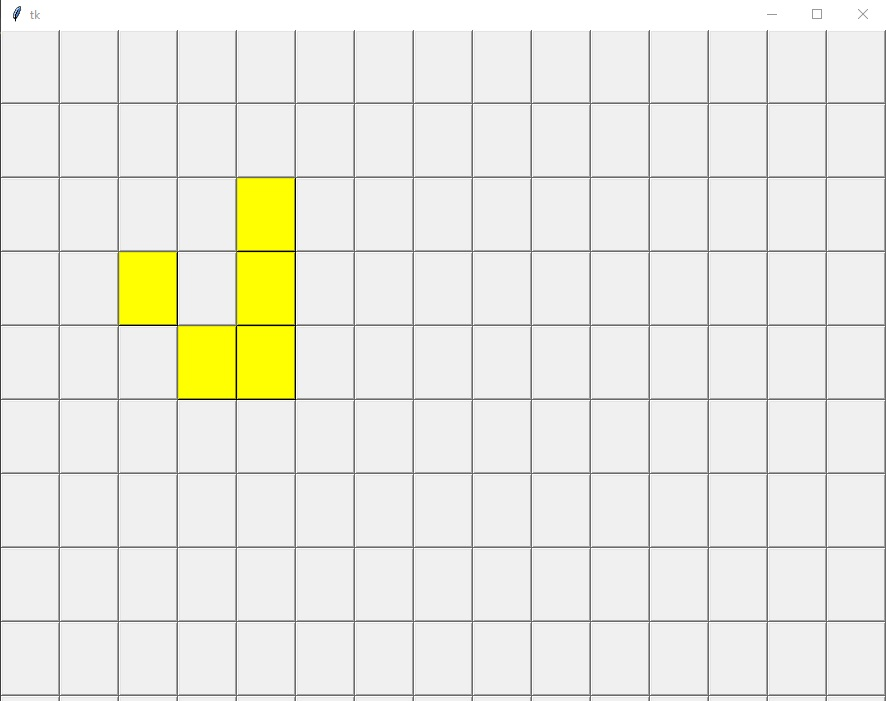

# Conways-Game-of-Life

I created this project to introduce myself to Python and tkinter. I wanted to create something without the help of any tutorials so I created this implementation
on my own with only the rules of Conway's game of life, and documentation from Python and tkinter. 

In this implementation of Conway's game of life, I used 2 seperate files. life.py is a standard python class that is in charge of all of the logic involved
with the rules of the game. life.py uses a 2d array to represent the grid for the game. The other file, user_interface.py uses standard Python and tkinter 
to create the grid which allows user to select squares to use as the starting template. After that, user_interface creates an instance of life.py and references
its attributes and functions to recieve new arrays in order to produce the next grids.

